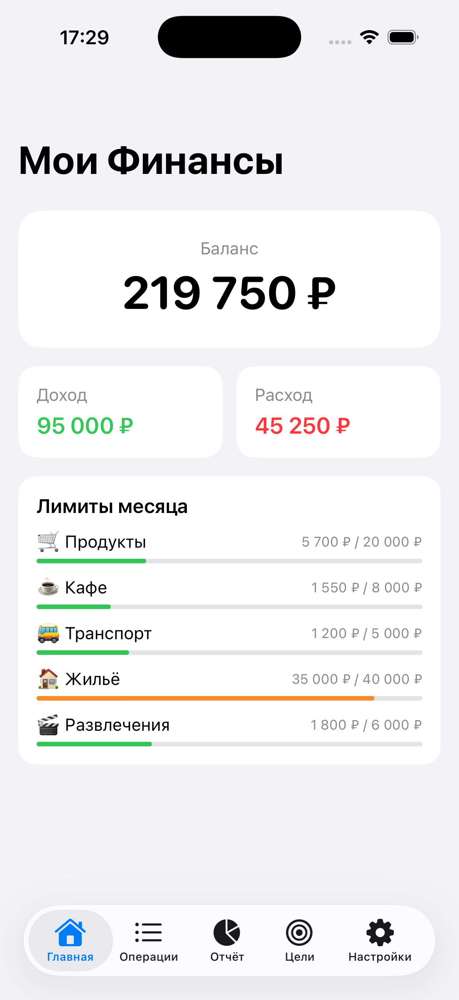
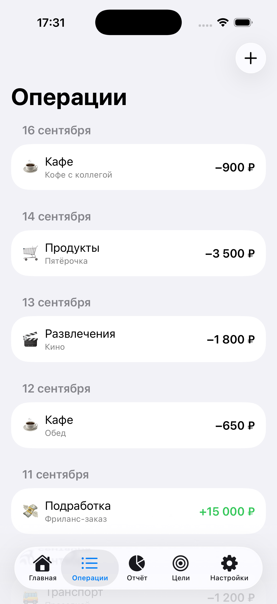
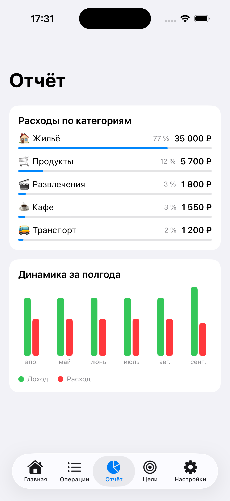
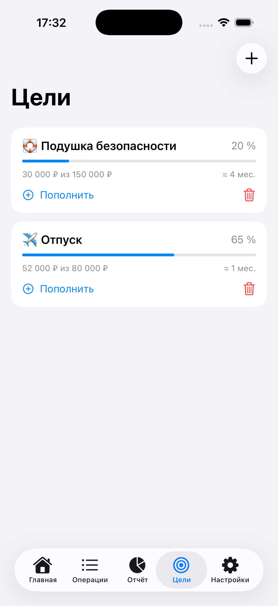
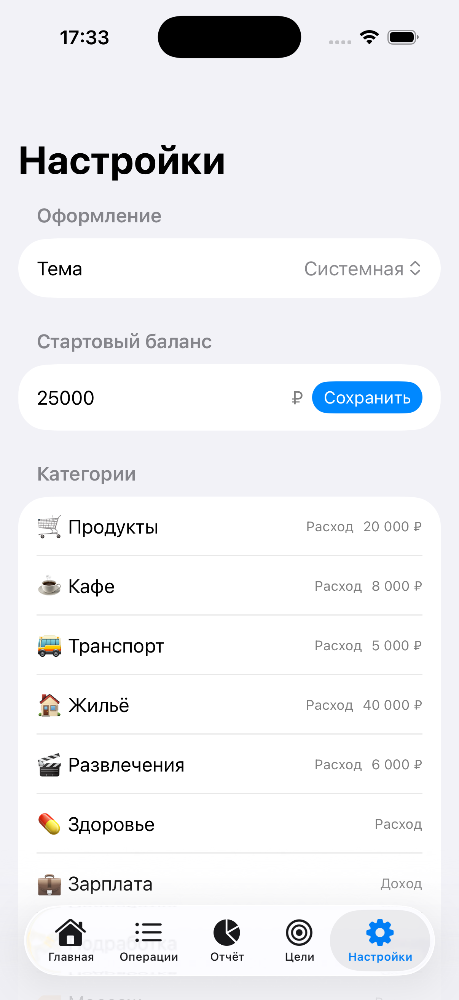

# Мои Финансы

iOS-приложение для учёта личных финансов. Операции по категориям, месячные лимиты,
цели накопления с прогнозом срока и отчёты по месяцам. Данные хранятся на устройстве.

Написано на SwiftUI, архитектура MVVM.

<p align="center">
  
  
  
</p>
<p align="center">
  
  
</p>

## Возможности

- Операции: сумма, переключатель расход/доход, категория, комментарий и дата.
- Лимиты: месячный потолок по расходной категории, цвет меняется от зелёного к
  красному по мере приближения к пределу.
- Цели: прогресс по каждой цели и прогноз срока по текущему темпу сбережений.
- Отчёты: доли расходов по категориям и динамика доходов и расходов за полгода.
- Темы: светлая и тёмная, следует системной настройке.

## Как устроено

Единый источник правды — класс `AppState`. Он держит данные и считает производные
величины: баланс, траты по категориям, доли в отчёте, прогноз по целям. Экраны
читают его и вызывают методы, а сам он пишет изменения в хранилище.

Хранилище спрятано за интерфейсом `load` / `save` (`LocalStore`, JSON-файлы в папке
Documents). Экраны не знают, где физически лежат данные. Чтобы добавить синхронизацию
с сервером, достаточно написать вторую реализацию с тем же интерфейсом, а экраны
трогать не придётся.

Состояние меняется заменой, а не правкой на месте (`goals[i] = updated`, а не
`goal.saved += ...`). Иначе SwiftUI не замечает изменение и не перерисовывает список.

```
Models.swift        структуры данных: операции, категории, цели, настройки
Defaults.swift      значения для первого запуска
LocalStore.swift    хранилище на JSON-файлах
Format.swift        форматирование сумм и дат
AppState.swift      состояние и вся логика
MyFinanceApp.swift  точка входа
RootView.swift      пять вкладок
HomeView, TransactionsView, AddTransactionSheet, ReportView, GoalsView, SettingsView
```

## Запуск

Открыть `MyFinance.xcodeproj` в Xcode 15 или новее, выбрать симулятор iPhone и нажать
Run. Минимальная версия — iOS 16.
